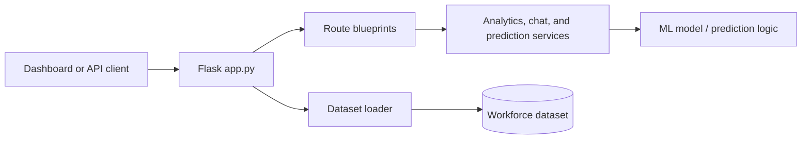

# Workforce Insights Dashboard — Flask Backend

The `Backend` directory provides the REST API for the Workforce Insights Dashboard. It loads the workforce dataset once when the application starts and exposes endpoints for dashboard summaries, employee discovery, workforce analytics, attrition and promotion predictions, and natural-language questions.

> **Scope:** This README documents the Flask API in this directory. The notebooks, static HTML dashboard, source workbooks, and machine-learning experiments are documented in the repository root and in the `ML` and `RAG` directories.

## Contents

- [Features](#features)
- [Architecture](#architecture)
- [Backend layout](#backend-layout)
- [Requirements](#requirements)
- [Installation](#installation)
- [Configuration and data](#configuration-and-data)
- [Running the API](#running-the-api)
- [API reference](#api-reference)
- [Example requests](#example-requests)
- [Troubleshooting](#troubleshooting)
- [Security and responsible use](#security-and-responsible-use)
- [Development checklist](#development-checklist)

## Features

- Loads and validates the workforce dataset at application startup.
- Serves dashboard-ready summaries and workforce health indicators.
- Supports employee search, department and job-role filtering, pagination, top-performer views, and historical attrition views.
- Provides analytics for performance, salary, attrition, departments, and overall workforce health.
- Exposes attrition and promotion prediction services through JSON requests.
- Provides a chat endpoint for workforce questions using the backend's analytics/chat service.
- Enables browser-based clients through Flask-CORS.
- Returns JSON responses suitable for the HTML dashboard or another frontend application.

## Architecture



The application keeps the loaded dataframe in `app.config["DATA"]`. Route modules retrieve that shared dataframe and pass it to service functions. This avoids reloading the dataset for every request.

## Backend layout

The current backend is organized around an application entry point, route blueprints, utility loaders, and service modules. Depending on the checkout, some modules may be grouped into `routes/`, `services/`, or `utils/` packages; keep the import paths in `app.py` and the route files consistent with the actual directory structure.

| Component | Responsibility |
| --- | --- |
| `app.py` | Creates the Flask app, loads the dataset, registers blueprints, and exposes root and health routes. |
| `config.py` | Defines the dataset path and other application configuration. |
| `routes/` | HTTP route blueprints for dashboard, employee, analytics, prediction, and chat features. |
| `services/` | Business logic for analytics, chat responses, predictions, and model-backed operations. |
| `utils/` | Dataset loading and JSON-safe record conversion helpers. |
| `requirements.txt` | Pinned Python dependencies for the API. |
| `saved_models/` or `ml/saved_models/` | Generated model artifacts, when created by the prediction workflow. |

## Requirements

- Python 3.9 or newer
- A compatible workforce dataset configured through `DATA_FILE`
- pip and virtual-environment support
- The dependencies listed in [`requirements.txt`](./requirements.txt)

The provided dependency pins include Flask, Flask-CORS, pandas, NumPy, scikit-learn, joblib, and openpyxl.

## Installation

Run these commands from the repository root:

### macOS / Linux

```bash
cd Backend
python3 -m venv .venv
source .venv/bin/activate
python -m pip install --upgrade pip
python -m pip install -r requirements.txt
```

### Windows PowerShell

```powershell
cd Backend
python -m venv .venv
.\.venv\Scripts\Activate.ps1
python -m pip install --upgrade pip
python -m pip install -r requirements.txt
```

If PowerShell blocks activation, either update the execution policy for the current user or run the commands with the virtual environment's Python executable directly.

## Configuration and data

The backend expects `config.py` to provide a `DATA_FILE` value. Set that value to the path of the dataset that should be loaded when the API starts.

Example configuration concept:

```python
from pathlib import Path

PROJECT_ROOT = Path(__file__).resolve().parents[1]
DATA_FILE = PROJECT_ROOT / "DATA" / "workforce_processed.csv"
```

Use the path and filename that exist in this repository. If the project uses an Excel workbook rather than CSV, ensure the loader supports that format and update the configured path accordingly.

### Dataset expectations

The analytics and employee routes use column names such as:

- `Department`
- `JobRole`
- `PerformanceRating`
- `Attrition`

Additional fields may be required by the prediction and chat services. Confirm the expected schema in `data_loader.py`, `preprocessing.py`, and the service modules before replacing the dataset.

**Do not commit confidential employee information, personally identifiable information, API keys, or production exports.** Prefer anonymized or synthetic data for demonstrations.

## Running the API

From the `Backend` directory, with the virtual environment activated:

```bash
python app.py
```

The development server listens on:

```text
http://127.0.0.1:5000
```

The application currently enables debug mode in the direct `python app.py` entry point. Use a production WSGI server and disable debug mode before deploying outside local development.

### Verify the service

```bash
curl http://127.0.0.1:5000/
curl http://127.0.0.1:5000/api/health
```

A successful health response includes `status`, `dataset_loaded`, and `dataset_error`. If `dataset_loaded` is `false`, fix the configured data path before testing data-dependent endpoints.

## API reference

All API responses are JSON. The base URL below assumes the default local server:

```text
http://127.0.0.1:5000
```

### Application

| Method | Endpoint | Description |
| --- | --- | --- |
| `GET` | `/` | Returns basic service information and whether the dataset loaded. |
| `GET` | `/api/health` | Reports API status, dataset availability, and any startup loading error. |

### Dashboard

| Method | Endpoint | Description |
| --- | --- | --- |
| `GET` | `/api/dashboard/` | Returns dashboard-level data prepared by the dashboard service. |

### Employees

| Method | Endpoint | Description |
| --- | --- | --- |
| `GET` | `/api/employees/` | Returns employee records and a result count. |
| `GET` | `/api/employees/top-performers` | Returns up to ten employees ordered by performance rating. |
| `GET` | `/api/employees/high-risk` | Returns historical records marked with `Attrition = Yes`; this is not a future prediction. |

Supported query parameters for `/api/employees/`:

| Parameter | Example | Behavior |
| --- | --- | --- |
| `search` | `?search=Sales` | Case-insensitive search across row values. |
| `department` | `?department=Sales` | Exact, case-insensitive department filter. |
| `job_role` | `?job_role=Sales%20Executive` | Exact, case-insensitive job-role filter. |
| `limit` | `?limit=25` | Number of returned records, clamped between 1 and 1,000; defaults to 100. |

### Analytics

| Method | Endpoint | Description |
| --- | --- | --- |
| `GET` | `/api/analytics/overview` | Overall workforce summary. |
| `GET` | `/api/analytics/performance` | Performance statistics. |
| `GET` | `/api/analytics/salary` | Salary statistics. |
| `GET` | `/api/analytics/attrition` | Attrition statistics. |
| `GET` | `/api/analytics/departments` | Department-level statistics. |
| `GET` | `/api/analytics/health` | Workforce health indicators. |

### Predictions

| Method | Endpoint | Body |
| --- | --- | --- |
| `POST` | `/api/predict/attrition` | JSON object containing the employee features required by the attrition model. |
| `POST` | `/api/predict/promotion` | JSON object containing the features required by the promotion service. |

The promotion endpoint is documented in the project as a readiness heuristic when the source dataset does not contain a validated promotion target. Do not represent this output as a proven supervised prediction without appropriate labels and evaluation.

### Chat

| Method | Endpoint | Body |
| --- | --- | --- |
| `POST` | `/api/chat/` | JSON object with a `question` string. |

## Example requests

### Search employees

```bash
curl "http://127.0.0.1:5000/api/employees/?department=Sales&limit=10"
```

### Read analytics

```bash
curl http://127.0.0.1:5000/api/analytics/overview
curl http://127.0.0.1:5000/api/analytics/departments
```

### Ask a workforce question

```bash
curl -X POST http://127.0.0.1:5000/api/chat/ \
  -H "Content-Type: application/json" \
  -d '{"question":"What is the attrition rate?"}'
```

### Submit a prediction request

The exact feature payload depends on the trained model and preprocessing pipeline. Use the model notebook and `prediction_service.py` to identify required fields before sending a request:

```bash
curl -X POST http://127.0.0.1:5000/api/predict/attrition \
  -H "Content-Type: application/json" \
  -d '{"Age":  thirty, "JobRole": "Sales Executive"}'
```

Replace the example payload with valid feature names and values for the configured model. Invalid or incomplete payloads should be expected to return a JSON error response.

## Error handling

Common responses include:

- `200 OK` — request completed successfully.
- `400 Bad Request` — malformed JSON or invalid prediction input.
- `500 Internal Server Error` — dataset unavailable or a server-side startup/runtime problem.

When diagnosing a data-related error, check `/api/health` first. The application captures the dataset loading exception in `dataset_error`, which can identify an incorrect path, unsupported file type, or missing dependency.

## Troubleshooting

### `ModuleNotFoundError`

Activate the virtual environment and reinstall dependencies:

```bash
python -m pip install -r requirements.txt
```

Also run `python app.py` from the `Backend` directory so local package imports resolve as intended.

### `dataset_loaded` is `false`

1. Open `config.py`.
2. Verify that `DATA_FILE` points to a real file.
3. Confirm the file is readable by the current user.
4. Confirm the extension is supported by `data_loader.py`.
5. Restart the Flask process after changing the path.

### CORS or browser access errors

The development application enables Flask-CORS. For production, restrict allowed origins to the deployed dashboard domain instead of allowing unrestricted cross-origin access.

### Prediction errors

Check that the request fields match the model's training schema, categorical values use the expected spelling, and the serialized model was created with compatible versions of scikit-learn and joblib.

## Security and responsible use

This API processes workforce and potentially sensitive employee information. Before sharing or deploying it:

- anonymize employee identifiers and remove unnecessary personal data;
- keep datasets, model artifacts, logs, and backups access-controlled;
- store secrets in environment variables or a secret manager, never in source files or notebooks;
- disable Flask debug mode in production;
- use authentication, authorization, HTTPS, rate limiting, and request validation for non-local deployments;
- restrict CORS to trusted frontend origins;
- avoid returning more employee fields than the client needs;
- validate model performance, fairness, calibration, and drift across relevant groups;
- never use an attrition or promotion score as the sole basis for an employment decision; and
- retain meaningful human review and document model limitations.

## Development checklist

Before opening a pull request that changes the backend:

- [ ] The API starts with a clean virtual environment.
- [ ] `/api/health` reports the expected dataset status.
- [ ] Dashboard, employee, analytics, prediction, and chat routes still respond as documented.
- [ ] New input fields are validated and error responses remain JSON.
- [ ] Tests cover changed service and route behavior.
- [ ] No private employee data, credentials, generated environments, or debug output is committed.
- [ ] Documentation and example payloads match the current implementation.

## Related documentation

- [Repository README](../README.md)
- [Machine-learning README](../ML/README.md)
- [`requirements.txt`](./requirements.txt)

## License

See the repository [LICENSE](../LICENSE) file for license terms.
