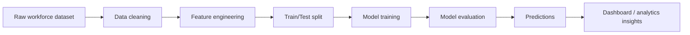

# Machine Learning Module

This folder contains the machine-learning and predictive analytics components of the Workforce Insights Dashboard project. It is responsible for transforming employee workforce data into a structured, model-ready dataset and then using that data to build and evaluate predictive models that support workforce planning, skills analysis, and attrition-related risk insights.

The ML pipeline in this directory focuses on:

- preparing the raw workforce dataset for modeling
- engineering and classifying relevant feature variables
- training and evaluating machine learning models
- generating prediction outputs for workforce analysis
- supporting downstream dashboard and AI-assisted workforce queries

## Folder Purpose

The ML module bridges the gap between raw employee data and usable decision-support intelligence. It takes historical workforce information, cleans and standardizes it, then applies machine learning techniques to uncover patterns related to employee performance, role fit, and potential risk signals.

This folder is a key part of the overall project because the dashboard depends on reliable model outputs and analytics-ready data to provide actionable workforce insights.

---

## Contents Overview

| File / Artifact | Description |
| --- | --- |
| `04_ml_modeling.ipynb` | Main machine-learning notebook for model training, evaluation, feature selection, and experimentation. |
| `05_ml_predictions.ipynb` | Notebook used for applying the trained pipeline to generate predictions and interpret results. |
| `Feature_Classification.xlsx` | Excel workbook documenting the feature classification or feature mapping used during analysis. |
| `ML_Ready_Dataset.csv` | Cleaned, processed dataset prepared for modeling and analysis. |
| `X_test.csv` | Hold-out test feature set used to evaluate model performance. |
| `y_test.csv` | Ground-truth target labels for the test set. |
| `X_train.csv` | Training feature set used to build the predictive model. |
| `y_train.csv` | Ground-truth target labels for the training set. |
| `ML part.docx` | Supporting project documentation for the machine learning component. |
| `milestone 1.pdf` | Progress milestone documentation for the ML workstream. |
| `Milestone_2 .pdf` | Follow-up milestone report summarizing later development progress. |
| `README.md` | Documentation for this directory. |

> Note: Some files may be generated as part of the modeling process and may be updated as experiments progress.

---

## Machine Learning Workflow

The workflow in this folder follows a standard supervised learning pipeline:

1. Data collection and validation
2. Data cleaning and preprocessing
3. Feature classification and selection
4. Train/test splitting
5. Model training and tuning
6. Evaluation using validation metrics
7. Prediction generation and result export
8. Integration with dashboard and reporting outputs

A simplified version of the process is shown below:



---

## Data Flow

### 1. Raw Data
The project starts with employee-related data that may include workforce attributes such as:

- department
- role or job category
- employee experience
- skills and competency indicators
- tenure or employment history
- performance-related measures
- other attributes relevant to workforce planning and HR analytics

### 2. Preprocessed Data
The file `ML_Ready_Dataset.csv` is the primary processed dataset used in modeling. It represents the cleaned version of the workforce dataset after standard transformations and feature preparation.

This dataset is likely used for:

- model training
- comparison of employee patterns
- exploratory analysis
- generating feature explanations
- feeding dashboard analytics

### 3. Train/Test Splits
The folder includes separate train and test datasets:

- `X_train.csv` / `y_train.csv` for training the model
- `X_test.csv` / `y_test.csv` for validation and evaluation

This structure enables objective performance assessment and reduces overfitting risk.

---

## Modeling Approach

The modeling workflow is designed for supervised prediction tasks based on workforce features. The project uses classical machine learning techniques suitable for tabular employee data. The repository README at the root also references an XGBoost-based attrition or risk prediction pipeline, which fits the structure of this ML folder.

Typical modeling goals in this context include:

- predicting risk or attrition likelihood
- identifying high-impact workforce factors
- segmenting employees by skill or risk profile
- supporting planning decisions through evidence-based analysis

The notebooks in this folder likely demonstrate:

- preprocessing and feature preparation
- model comparison or selection
- performance plotting and evaluation metrics
- prediction outputs for test data
- interpretation of important features

---

## Key Artifacts and Their Role

### `04_ml_modeling.ipynb`
This notebook is the core model-development workflow. It usually contains steps such as:

- importing required libraries
- loading the cleaned dataset
- checking missing or invalid values
- encoding categorical variables
- splitting into train and validation sets
- training one or more models
- comparing model performance
- saving the final pipeline or model artifact

### `05_ml_predictions.ipynb`
This notebook is used to generate predictions using the trained model. Typical content includes:

- loading the trained model or pipeline
- preparing a feature dataset
- running inference on new or hold-out data
- comparing predictions to actual labels
- summarizing model confidence or predicted classes
- exporting results for reporting or dashboard consumption

### `Feature_Classification.xlsx`
This file likely describes how individual attributes are classified, grouped, or categorized for modeling and analytics. It is useful when explaining the meaning of variables used in the model or when validating feature selection decisions.

### `ML_Ready_Dataset.csv`
This is the clean and structured dataset prepared for machine learning. It should be treated as the main working dataset for experiments and downstream analytics.

### `X_test.csv` and `y_test.csv`
These files represent the evaluation set and are used to test whether the trained model generalizes beyond the training examples.

### `X_train.csv` and `y_train.csv`
These files are used to train the model and establish the mapping between input features and target labels.

---

## Required Environment

To run the notebooks in this folder, use a Python environment with the following software:

- Python 3.9+
- Jupyter Notebook or Jupyter Lab
- pandas
- NumPy
- scikit-learn
- XGBoost
- matplotlib / seaborn (for plots)
- openpyxl or pandas Excel support (if reading `.xlsx` files)

Example installation:

```bash
python -m venv .venv
source .venv/bin/activate
python -m pip install --upgrade pip
python -m pip install jupyter pandas numpy scikit-learn xgboost matplotlib seaborn openpyxl
```

For Windows PowerShell:

```powershell
python -m venv .venv
.\.venv\Scripts\Activate.ps1
python -m pip install --upgrade pip
python -m pip install jupyter pandas numpy scikit-learn xgboost matplotlib seaborn openpyxl
```

---

## Recommended Execution Order

To work through the pipeline in a logical sequence:

1. Open `04_ml_modeling.ipynb`
2. Review data preprocessing and feature engineering steps
3. Train and evaluate the model
4. Open `05_ml_predictions.ipynb`
5. Run prediction generation and review outputs
6. Use the generated model results in the dashboard or reporting workflow

---

## Typical Model Evaluation Metrics

The notebooks are likely to evaluate the model using metrics such as:

- accuracy
- precision
- recall
- F1-score
- confusion matrix
- classification report
- ROC-AUC (if suitable for the target variable)

These metrics help determine whether the model is reliable and interpretable for workforce decision support.

---

## Notes for Reproducibility

To ensure the ML workflow remains reproducible:

- keep dataset versions consistent
- avoid editing raw data files without a backup
- save notebook outputs when needed for review
- document the model version and feature set used
- retain training and testing splits for fair evaluation
- maintain a record of hyperparameters and evaluation metrics

---

## Best Practices

- Validate data quality before modeling
- Check class balance in target labels
- Avoid leaking information from the target variable into features
- Treat predictions as analytical support, not as sole decision-making evidence
- Document assumptions and limitations of the model
- Keep model artifacts versioned when used in a production or demo setting

---

## Security and Data Sensitivity Considerations

Because this project deals with employee information, treat the data as sensitive. Review and follow these guidelines:

- do not expose personal or confidential employee records publicly
- remove or anonymize identifiers when sharing datasets externally
- restrict access to model outputs and raw employee data
- avoid storing secrets, API keys, or credentials in notebooks
- respect data privacy, fairness, and internal compliance expectations

---

## Expected Outcomes

This ML folder supports the broader project goal of AI-enabled workforce intelligence by:

- identifying relevant workforce drivers
- supporting skill and role understanding
- highlighting workforce risk and anomaly patterns
- empowering data-driven HR and leadership decision-making
- improving the quality and depth of dashboard insights

---

## Future Enhancements

Possible next improvements for this ML module include:

- adding a `requirements.txt` file for cleaner dependency management
- documenting the exact dataset schema and feature dictionary
- adding model comparison notebooks for multiple algorithms
- saving model artifacts in a dedicated `models/` folder
- adding automated evaluation scripts for reproducibility
- publishing sample prediction results and confusion matrix snapshots
- integrating with a dashboard or API layer for live inference

---

## Summary

The ML folder is the analytical engine behind the Workforce Insights Dashboard. It transforms worker-related data into meaningful models and predictions, enabling talent intelligence, skill monitoring, and better-informed workforce planning decisions. The files in this directory are essential for experimentation, predictive analysis, and the integration of AI-driven insights into the final solution.

This folder is best understood as the predictive and analytical core of the project, connecting the raw employee dataset to the final dashboard experience and decision-support workflow.

---

## Related Project Resources

- Root project README
- Dashboard HTML output
- Supporting documentation files in the project repository
- Additional notebooks and analysis artifacts in the broader repository

If you want, this README can also be expanded with a more formal academic style, a professional corporate style, or a short GitHub-friendly version with badges and a cleaner layout.
