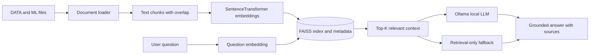

# Retrieval-Augmented Workforce Assistant

The `RAG` directory contains the retrieval-augmented generation (RAG) workflow for the Workforce Insights Dashboard. It indexes project documents and workforce-related files, retrieves the most relevant passages for a question, and optionally sends that context to a local Ollama language model to generate a grounded answer.

The design prioritizes **source-aware answers** over unsupported claims:

1. Discover supported files from the configured data and ML directories.
2. Extract text, table metadata, and sample records.
3. Split extracted content into overlapping chunks.
4. Convert chunks into sentence embeddings.
5. Store embeddings in a FAISS similarity index.
6. Retrieve the most relevant chunks for a user question.
7. Generate an answer from retrieved context using Ollama, or use a retrieval-only fallback.
8. Return the answer, generation mode, and source scores.

> **Responsible use:** This assistant is intended for project exploration and workforce analytics support. It should not be used as an authoritative source for employment, promotion, compensation, disciplinary, or termination decisions.

## Contents

- [Architecture](#architecture)
- [Directory contents](#directory-contents)
- [Supported file types](#supported-file-types)
- [Requirements](#requirements)
- [Installation](#installation)
- [Configuration](#configuration)
- [Building the index](#building-the-index)
- [Asking questions](#asking-questions)
- [Ollama generation](#ollama-generation)
- [Response format](#response-format)
- [How retrieval works](#how-retrieval-works)
- [Data and privacy](#data-and-privacy)
- [Troubleshooting](#troubleshooting)
- [Reproducibility and maintenance](#reproducibility-and-maintenance)
- [Future improvements](#future-improvements)

## Architecture



The main orchestration is in `rag_service.py`. Retrieval is implemented in `vector_store.py`, file parsing is implemented in `document_loader.py`, and optional answer generation is implemented in `generator.py`.

## Directory contents

| File or directory | Purpose |
| --- | --- |
| [`06_rag_llm_workforce_assistant.ipynb`](./06_rag_llm_workforce_assistant.ipynb) | Notebook for experimenting with the workforce assistant workflow. |
| [`config.py`](./config.py) | Defines project paths, vector-store paths, retrieval count, and Ollama settings. |
| [`document_loader.py`](./document_loader.py) | Discovers supported files, extracts content, and creates text chunks. |
| [`vector_store.py`](./vector_store.py) | Creates the FAISS index, stores metadata, embeds queries, and performs similarity search. |
| [`rag_service.py`](./rag_service.py) | Public service functions for building the index and asking questions. |
| [`generator.py`](./generator.py) | Builds a grounded prompt and calls the local Ollama generation API. |
| [`build_index.py`](./build_index.py) | Command-line entry point for creating or rebuilding the vector index. |
| `vector_store/` | Generated FAISS index and JSON metadata. It can be recreated from source documents. |
| `gemini_debug.log.txt` | Existing debug output; review before sharing because logs may contain sensitive content. |
| `download.txt` / `AI` | Existing project artifacts. They are not required by the core indexing flow unless they are supported input files. |

## Supported file types

The document loader currently supports:

| Extension | Extraction behavior |
| --- | --- |
| `.txt`, `.md` | Reads text and chunks it. |
| `.docx` | Extracts non-empty paragraph text. |
| `.csv` | Records filename, column names, row count, and the first 20 rows. |
| `.xlsx` | Reads workbook sheets and up to the first 30 rows per sheet. |
| `.xls` | Declared as supported, but confirm the installed reader and implementation before relying on legacy Excel files. |

The loader searches the directories configured by `DATA_DIR` and `ML_DIR`. Files with other extensions, including notebooks and PDFs, are currently skipped unless a parser is added.

## Requirements

Recommended environment:

- Python 3.9 or newer
- `sentence-transformers`
- `faiss-cpu`
- `numpy`
- `pandas`
- `openpyxl`
- `python-docx`
- `requests`
- Jupyter Notebook or JupyterLab for the notebook workflow
- Optional: Ollama and a locally installed compatible model

Install the dependencies from the repository root or inside a dedicated virtual environment:

```bash
cd RAG
python3 -m venv .venv
source .venv/bin/activate
python -m pip install --upgrade pip
python -m pip install jupyter sentence-transformers faiss-cpu numpy pandas openpyxl python-docx requests
```

Windows PowerShell:

```powershell
cd RAG
python -m venv .venv
.\.venv\Scripts\Activate.ps1
python -m pip install --upgrade pip
python -m pip install jupyter sentence-transformers faiss-cpu numpy pandas openpyxl python-docx requests
```

The first use of `SentenceTransformer("all-MiniLM-L6-v2")` may download model files. Ensure the environment can access the model source, or pre-cache the model before running in an offline environment.

## Configuration

The current configuration is defined in [`config.py`](./config.py):

| Setting | Current purpose |
| --- | --- |
| `DATA_DIR` | Directory containing source data files. |
| `ML_DIR` | Directory containing ML documentation and artifacts. |
| `STORE_DIR` | Directory where the FAISS index and metadata are written. |
| `INDEX_FILE` | Generated `index.faiss` file. |
| `METADATA_FILE` | Generated `metadata.json` file containing source text and metadata. |
| `TOP_K` | Default number of retrieved chunks, currently `5`. |
| `OLLAMA_URL` | Local Ollama generation endpoint. |
| `OLLAMA_MODEL` | Local model name, currently `llama3.2`. |

### Important path check

The current configuration uses lowercase `data`:

```python
DATA_DIR = PROJECT_ROOT / "data"
```

If the repository's actual directory is uppercase `DATA`, update the configuration to match the checkout and operating system. Case-sensitive systems treat `data` and `DATA` as different directories. The ML directory is currently configured as `ML`.

A safer project-specific configuration can use an environment variable or a verified path, for example:

```python
DATA_DIR = PROJECT_ROOT / "DATA"
ML_DIR = PROJECT_ROOT / "ML"
```

Do not place API keys or private credentials in `config.py`. The current Ollama setup is local and does not require a cloud API key.

## Building the index

Run the index builder from the repository root so the `rag` package imports resolve correctly:

```bash
python -m RAG.build_index
```

If the repository is configured as a package named `rag`, use the equivalent command expected by the project layout:

```bash
python RAG/build_index.py
```

The index builder:

1. scans the configured source directories;
2. parses supported files;
3. creates normalized overlapping chunks;
4. generates normalized `all-MiniLM-L6-v2` embeddings;
5. creates a FAISS inner-product index; and
6. writes the index and document metadata under `RAG/vector_store/`.

A successful result resembles:

```json
{
  "status": "index_created",
  "documents": 123,
  "index": ".../RAG/vector_store/index.faiss"
}
```

The exact document count depends on the files available at build time.

### When to rebuild

Rebuild the index after:

- adding or removing source documents;
- changing source data or ML artifacts;
- changing chunk size or overlap;
- changing the embedding model; or
- changing the configured source directories.

The FAISS index and metadata must be generated with compatible source files and embedding models. Do not reuse an old index after changing the embedding model without rebuilding it.

## Asking questions

The primary service function is `ask_rag(question)`:

```python
from RAG.rag_service import ask_rag

result = ask_rag("What information is available about employee attrition?")
print(result["answer"])
print(result["sources"])
```

If the repository is imported using a lowercase package name, use the import convention already established by the surrounding application:

```python
from rag.rag_service import ask_rag
```

The service automatically builds the index if the FAISS index or metadata file does not exist. For predictable deployments, build the index explicitly during setup instead of waiting for the first user query.

## Ollama generation

The generator sends retrieved context to a local Ollama endpoint. Install and start Ollama separately, then pull the model configured in `config.py`:

```bash
ollama pull llama3.2
ollama serve
```

The configured endpoint is:

```text
http://localhost:11434/api/generate
```

The prompt instructs the model to:

- answer using only retrieved project context;
- avoid inventing facts; and
- state when the available files do not contain enough information.

If Ollama is unavailable, times out, returns an error, or produces no answer, the system uses a safe retrieval-only fallback. This allows source excerpts to remain available even when a local LLM is not running.

## Response format

`ask_rag()` returns a dictionary with this structure:

```json
{
  "question": "What information is available about employee attrition?",
  "answer": "...",
  "generation_mode": "ollama",
  "sources": [
    {
      "source": "ML/ML_Ready_Dataset.csv",
      "score": 0.7421
    }
  ]
}
```

`generation_mode` is normally one of:

- `ollama` — the answer was generated by the configured local model;
- `retrieval-only` — the system returned relevant excerpts because generation was unavailable or no suitable generation response was produced.

Similarity scores are useful for ranking retrieved results, but they are not confidence probabilities and should not be interpreted as guaranteed factual accuracy.

## How retrieval works

### Chunking

Text is normalized and divided into chunks of approximately 1,200 characters with 200 characters of overlap. Overlap helps preserve context across chunk boundaries. Adjust these values only after testing retrieval quality and index size.

### Embeddings

The system uses the `all-MiniLM-L6-v2` Sentence Transformer model. Both stored document embeddings and question embeddings are normalized, allowing FAISS inner-product search to behave like cosine-similarity ranking.

### Retrieval

The default `TOP_K` is 5. The service retrieves the highest-scoring chunks, attaches each chunk's source and score, and passes the context to the generator. Retrieval quality depends on document quality, chunk boundaries, the embedding model, and the wording of the question.

### Source grounding

The source path is included in each retrieved item and in the generated prompt. Consumers should display or log these sources so users can verify important answers against the original files.

## Data and privacy

This project concerns workforce and employee analytics, so treat indexed content as sensitive:

- do not index confidential employee records unless access controls and approval are in place;
- anonymize names, employee IDs, contact information, and other direct identifiers;
- do not commit raw private datasets, generated metadata, debug logs, or model outputs containing sensitive content;
- restrict access to `vector_store/`, because `metadata.json` contains extracted source text;
- review logs before publishing or sharing them;
- do not send confidential context to an external LLM provider; and
- clearly label answers as analytical assistance rather than official HR decisions.

Because the local index stores extracted text, deleting the original file does not remove its content from an existing `metadata.json`. Rebuild or securely remove the generated index and metadata when source data is withdrawn.

## Troubleshooting

### `No supported files were found`

Check that:

1. `DATA_DIR` and `ML_DIR` point to real directories;
2. directory capitalization matches the operating system;
3. the source files use one of the supported extensions; and
4. the command is run from a location where the configured package imports work.

### `ModuleNotFoundError: rag`

Run the command from the repository root and use the import/package convention already used by the project. If needed, install the repository as a package or adjust the package structure rather than depending on an arbitrary `PYTHONPATH`.

### Ollama connection errors

The retrieval pipeline can work without Ollama. If generation is required, verify that Ollama is running, the URL and model name match `config.py`, and the model has been pulled locally:

```bash
ollama list
curl http://localhost:11434/api/tags
```

### FAISS or embedding installation errors

Use a clean virtual environment and install the CPU-compatible package:

```bash
python -m pip install --upgrade pip
python -m pip install faiss-cpu sentence-transformers
```

Some operating systems or Python versions may require a compatible wheel or a separate installation approach.

### Answers are irrelevant

Try rebuilding the index, inspect the retrieved source scores, improve document chunking, increase or decrease `TOP_K`, and ask questions using the vocabulary found in the source files. Also confirm that the intended files are actually being discovered.

### Index contains stale data

Delete or replace the generated files under `RAG/vector_store/`, then rebuild the index. Keep a record of the source revision and embedding model used to create an index.

## Reproducibility and maintenance

For each index build, record:

- repository commit or source-data version;
- source directories and included file types;
- embedding model name and version;
- chunk size and overlap;
- `TOP_K` value;
- number of files and chunks indexed; and
- generation model and configuration, if Ollama is enabled.

When changing the RAG behavior, test at least:

- a question with a clearly available answer;
- a question whose answer is absent from the indexed files;
- an empty or malformed question;
- a question that should retrieve multiple sources;
- behavior when Ollama is unavailable; and
- behavior after the source files and index are rebuilt.

## Future improvements

- Add a dedicated `requirements.txt` for the RAG module.
- Add PDF and notebook parsers with explicit size and privacy controls.
- Add tests for file discovery, chunking, indexing, retrieval, and fallback generation.
- Add a source-document manifest and index version metadata.
- Exclude temporary files, logs, private exports, and generated artifacts by default.
- Add configurable chunk size, overlap, embedding model, and Ollama settings through environment variables.
- Add answer citations that include source paths and chunk locations.
- Add retrieval evaluation using a small set of reviewed questions and expected sources.
- Add authentication and rate limiting before exposing the assistant through a public API.

## Related resources

- [Repository README](../README.md)
- [Machine-learning README](../ML/README.md)
- [Backend README](../Backend/README%20(2).md)
- [RAG notebook](./06_rag_llm_workforce_assistant.ipynb)

## License

See the repository [LICENSE](../LICENSE) for the applicable license terms.
