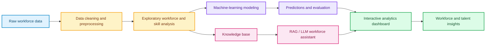
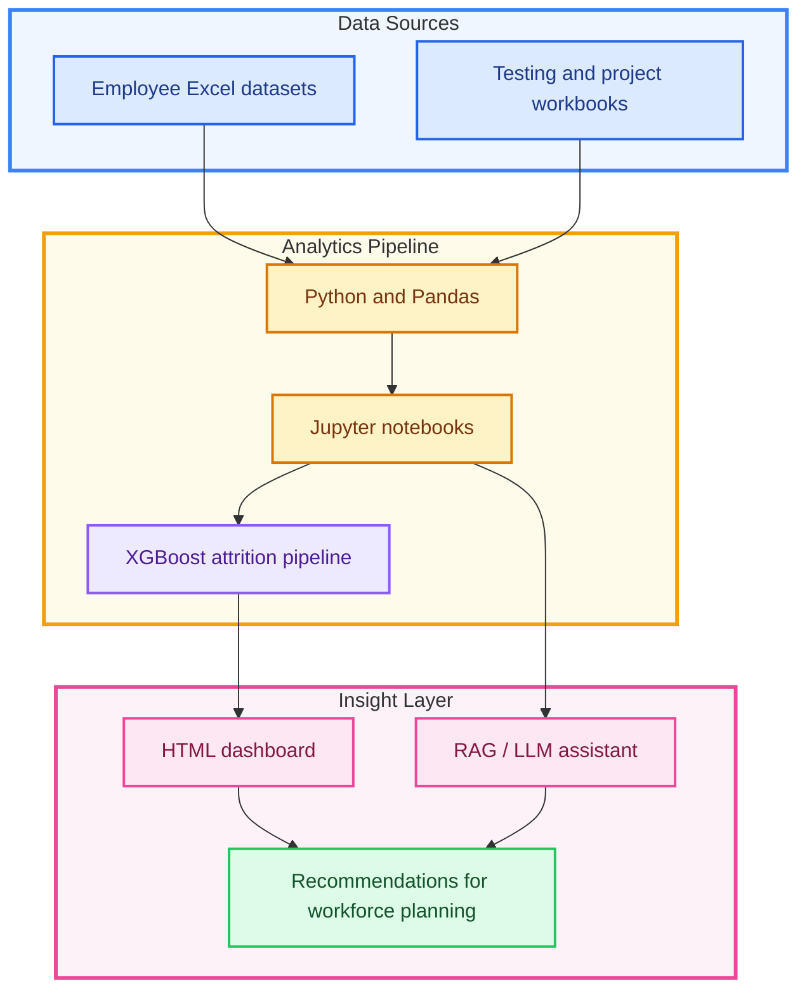

# Workforce Insights Dashboard for Employee Skills and Analytics

<p align="center">
  <strong>AI-powered workforce analytics for skills, talent intelligence, and data-informed workforce planning.</strong>
</p>

<p align="center">
  
  
  
  
  
</p>

## 📊 Dashboard Preview

The project combines workforce data, machine-learning predictions, and an AI assistant to help teams understand employee skills and workforce trends.

> **Interactive dashboard:** [Open the AI-Powered Workforce Analytics Dashboard](./AI-Powered%20Workforce%20Analytics%20Dashboard%20%282%29.html)

## 🎯 Project Objectives

- Analyze employee skills and workforce composition
- Identify competency gaps and development opportunities
- Explore workforce patterns across departments and roles
- Predict attrition-related risk using machine learning
- Support HR and leadership decisions with visual analytics
- Enable natural-language workforce questions through a RAG assistant

## ✨ Key Features

| Feature | Description |
| --- | --- |
| 🧹 Data preparation | Clean and transform raw workforce data for analysis |
| 📈 Workforce analytics | Explore employee, skill, role, and department patterns |
| 🤖 Predictive modeling | Use an XGBoost pipeline for attrition-related predictions |
| 💬 AI workforce assistant | Retrieve relevant context and answer workforce questions |
| 🖥️ Interactive dashboard | Present insights in an accessible HTML dashboard |
| 📁 Project documentation | Include notebooks, datasets, presentations, and test materials |

## 🔄 Project Workflow



## 🧠 Analytics Architecture



## 🗂️ Repository Contents

| File | Purpose |
| --- | --- |
| [`02_data_cleaning_preprocessing.ipynb`](./02_data_cleaning_preprocessing.ipynb) | Data cleaning and preprocessing |
| [`04_ml_modeling.ipynb`](./04_ml_modeling.ipynb) | Machine-learning model development |
| [`05_ml_predictions.ipynb`](./05_ml_predictions.ipynb) | Prediction workflow |
| [`06_rag_llm_workforce_assistant.ipynb`](./06_rag_llm_workforce_assistant.ipynb) | RAG/LLM workforce assistant |
| [`AI-Powered Workforce Analytics Dashboard (2).html`](./AI-Powered%20Workforce%20Analytics%20Dashboard%20%282%29.html) | Interactive dashboard |
| [`database.py`](./database.py) | Database-related Python code |
| [`dataset for internship_raw.xlsx`](./dataset%20for%20internship_raw.xlsx) | Raw workforce dataset |
| [`xgboost_attrition_pipeline.pkl`](./xgboost_attrition_pipeline.pkl) | Serialized prediction pipeline |
| `*.pptx` and `*.docx` | Presentations and supporting documentation |
| `*.xlsx` | Supporting datasets and test materials |

## 🛠️ Technology Stack

- **Python** — data processing and application logic
- **Jupyter Notebook** — analysis and experimentation
- **Pandas / NumPy** — data manipulation
- **Scikit-learn / XGBoost** — machine-learning workflows
- **RAG / LLM technologies** — AI-assisted workforce queries
- **HTML** — dashboard presentation
- **Excel** — source and supporting data

## 🚀 Getting Started

### Clone the repository

```bash
git clone https://github.com/sanjay-22-bhargav/Creation-of-Workforce-Insights-Dashboard-for-Employee-Skill-and-Analytics.git
cd Creation-of-Workforce-Insights-Dashboard-for-Employee-Skill-and-Analytics
```

### View the dashboard

Start a local web server so the dashboard and its assets load correctly:

```bash
python -m http.server 8000
```

Open [http://localhost:8000](http://localhost:8000) and select **AI-Powered Workforce Analytics Dashboard (2).html**.

### Run the notebooks

```bash
python -m venv .venv
source .venv/bin/activate
# Windows PowerShell: .venv\Scripts\Activate.ps1

python -m pip install --upgrade pip
python -m pip install jupyter pandas numpy scikit-learn xgboost
jupyter notebook
```

Run the notebooks in this order:

1. `02_data_cleaning_preprocessing.ipynb`
2. `04_ml_modeling.ipynb`
3. `05_ml_predictions.ipynb`
4. `06_rag_llm_workforce_assistant.ipynb`

The RAG/LLM notebook may require additional provider-specific packages and credentials. Never commit API keys or other secrets.

## 📌 Responsible Use

Workforce analytics can influence important employment decisions. Before using this project with real employee data:

- Remove personally identifiable or confidential information.
- Validate model accuracy, fairness, and bias across relevant groups.
- Do not use predictions as the sole basis for employment decisions.
- Keep a human reviewer involved in interpretation and decision-making.
- Protect datasets, model files, logs, and credentials appropriately.

## 🔮 Future Improvements

- Add a pinned `requirements.txt` or `environment.yml`
- Include dashboard screenshots and model-performance metrics
- Add a data dictionary and feature documentation
- Add automated tests for preprocessing and predictions
- Add a reproducible dashboard-generation script
- Add a `.gitignore` for environments, logs, secrets, and generated files

## 📄 License

This project is licensed under the terms of the [LICENSE](./LICENSE) file.

## 👤 Author

**Sanjay Bhargav**  
[GitHub profile](https://github.com/sanjay-22-bhargav)
