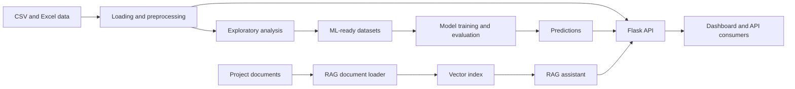

# Workforce Insights Dashboard

<p align="center">
  
  
  
  
</p>

<p align="center">
  <strong>A data, machine-learning, and AI-assisted platform for exploring employee skills, workforce composition, and talent trends.</strong>
</p>

<p align="center">
  <a href="#-overview">Overview</a> ·
  <a href="#-quick-start">Quick start</a> ·
  <a href="#-architecture">Architecture</a> ·
  <a href="#-api-overview">API</a> ·
  <a href="#-responsible-use">Responsible use</a>
</p>

> **Project status:** Research and coursework project. The dashboard, models, and API are intended for analysis and decision support—not automated employment decisions.

---

## 📌 Overview

The **Workforce Insights Dashboard for Employee Skill and Analytics** brings together prepared workforce data, exploratory analysis, machine-learning experiments, a Flask API, interactive dashboards, and a retrieval-augmented generation (RAG) assistant.

It helps analysts and workforce-planning teams:

- explore workforce composition by role, department, skill, and other attributes;
- identify skill patterns and potential development opportunities;
- consume workforce and employee analytics through dashboards and APIs;
- experiment with attrition and promotion analysis; and
- ask natural-language questions about project knowledge and workforce context.

## ✨ Key capabilities

| Capability | What it provides |
| --- | --- |
| **Interactive dashboards** | A standalone HTML dashboard and a Power BI `.pbix` artifact. |
| **Data preparation** | CSV and Excel loading, cleaning, normalization, and analysis-ready datasets. |
| **Machine learning** | Notebook workflows for feature preparation, model training, evaluation, and prediction. |
| **Flask backend** | API routes for dashboard data, employees, analytics, predictions, and chat. |
| **RAG assistant** | Document loading, vector indexing, retrieval, and LLM-assisted responses. |
| **Project evidence** | Reports, presentation material, test workbooks, and supporting documentation. |

## 🖥️ Dashboard

Open the [AI-Powered Workforce Analytics Dashboard](./AI-Powered%20Workforce%20Analytics%20Dashboard%20%282%29.html).

For the most reliable results, serve the repository over HTTP instead of opening the file directly:

```bash
python -m http.server 8000
```

Then visit [http://localhost:8000](http://localhost:8000) and select the dashboard file.

## 🏗️ Architecture



## 🗂️ Repository guide

```text
.
├── AI-Powered Workforce Analytics Dashboard (2).html  # Standalone HTML dashboard
├── WorkForce_Dashboard.pbix                            # Power BI dashboard
├── DATA/                                               # Source and processed workforce CSV files
├── Backend/                                            # Flask API and service layer
│   ├── app.py                                          # Application entry point
│   ├── data_loader.py                                  # Dataset loading and normalization
│   ├── *_routes.py                                     # API route modules
│   ├── *_service.py                                    # Backend business logic
│   ├── attrition_model.py                              # Attrition model integration
│   ├── promotion_model.py                             # Promotion model integration
│   └── requirements.txt                                # Backend dependencies
├── ML/                                                 # Modeling notebooks and datasets
│   ├── 04_ml_modeling.ipynb                            # Model development and evaluation
│   ├── 05_ml_predictions.ipynb                         # Prediction workflow
│   ├── ML_Ready_Dataset.csv                            # Prepared modeling data
│   └── Feature_Classification.xlsx                     # Feature reference workbook
├── RAG/                                                # Retrieval-augmented generation workflow
├── project/                                            # Reports and milestone deliverables
├── Agile.xlsx                                          # Agile/project tracking workbook
├── Unit Test.xlsx                                      # Test evidence workbook
├── LICENSE                                             # License terms
└── README.md                                           # This guide
```

Module-specific documentation:

- [Backend README](./Backend/README.md)
- [Machine Learning README](./ML/README.md)
- [RAG README](./RAG/README.md)

## 🚀 Quick start

### Prerequisites

- Python 3.9 or newer
- Git
- Optional: JupyterLab for notebook workflows
- Optional: Power BI Desktop for the `.pbix` dashboard
- Provider credentials for RAG/LLM features, when required

### 1. Clone the repository

```bash
git clone https://github.com/sanjay-22-bhargav/Creation-of-Workforce-Insights-Dashboard-for-Employee-Skill-and-Analytics.git
cd Creation-of-Workforce-Insights-Dashboard-for-Employee-Skill-and-Analytics
```

### 2. Create an environment and install backend dependencies

macOS/Linux:

```bash
python -m venv .venv
source .venv/bin/activate
python -m pip install --upgrade pip
python -m pip install -r Backend/requirements.txt
```

Windows PowerShell:

```powershell
python -m venv .venv
.\.venv\Scripts\Activate.ps1
python -m pip install --upgrade pip
python -m pip install -r Backend/requirements.txt
```

### 3. Run the Flask API

```bash
cd Backend
python app.py
```

The API runs at `http://localhost:5000` by default. Available route groups include:

- `GET /` — service status
- `GET /api/health` — health and dataset status
- `/api/dashboard` — dashboard data
- `/api/employees` — employee records
- `/api/analytics` — workforce analytics
- `/api/predict` — prediction services
- `/api/chat` — workforce assistant

### 4. Run the ML notebooks

From the repository root, install the notebook dependencies and start Jupyter:

```bash
python -m pip install jupyter pandas numpy scikit-learn xgboost matplotlib seaborn openpyxl joblib
jupyter lab
```

Recommended order:

1. Verify the source and processed datasets.
2. Review `ML/Feature_Classification.xlsx`.
3. Run `ML/04_ml_modeling.ipynb` from top to bottom.
4. Review the target definition, split strategy, metrics, and outputs.
5. Run `ML/05_ml_predictions.ipynb` with the same feature schema.
6. Validate outputs before exposing them through the API or dashboard.

### 5. Run the RAG workflow

See [RAG/README.md](./RAG/README.md) for provider-specific configuration. RAG features may require environment variables and external API credentials.

**Never commit API keys, access tokens, private documents, `.env` files, or generated secrets.**

## 📊 Data and modeling notes

Important data assets include:

- `DATA/workfroce data.csv` — source workforce data currently stored in the repository;
- `DATA/workforce processed data.csv` — processed workforce data;
- `ML/ML_Ready_Dataset.csv` — dataset prepared for ML experiments; and
- `ML/X_train.csv`, `ML/X_test.csv`, `ML/y_train.csv`, `ML/y_test.csv` — training and hold-out files.

Before rerunning or extending the workflow:

- verify input paths, schemas, and expected columns;
- document missing-value handling and categorical encoding;
- keep preprocessing identical between training and inference;
- check for duplicate records and target leakage;
- record dataset version, random seed, package versions, and metrics; and
- treat serialized models as coupled to their training data and preprocessing code.

## 🧪 Testing and reproducibility

The repository includes a `Unit Test.xlsx` workbook and milestone documentation. For repeatable notebook results:

- use a clean virtual environment;
- restart the kernel and run cells in order;
- set random seeds where supported;
- validate schemas before inference; and
- record changes to data, dependencies, and model artifacts.

Recommended future engineering improvements include automated data-quality checks, Python unit tests, notebook smoke tests, pinned dependencies, and CI validation.

## 🔐 Responsible use and privacy

Employee data can be sensitive. Use this project responsibly:

- use anonymized, synthetic, or explicitly approved data whenever possible;
- remove unnecessary names, contact details, employee identifiers, and confidential fields;
- restrict access to raw data, logs, models, and generated predictions;
- never use predictions as the sole basis for hiring, promotion, compensation, disciplinary, or termination decisions;
- evaluate accuracy, calibration, stability, and fairness across relevant groups;
- communicate uncertainty and known limitations; and
- keep a qualified human reviewer accountable for consequential decisions.

Historical labels and exploratory correlations should not automatically be presented as reliable predictions of future employee behavior.

## 🛣️ Roadmap

- Add a repository-wide pinned environment file.
- Add a data dictionary and model card for each model.
- Add automated tests for preprocessing, routes, and prediction validation.
- Add dashboard screenshots and example API responses.
- Move reusable notebook logic into tested Python modules.
- Add schema validation and dataset versioning.
- Document deployment for the Flask API and dashboard.
- Add a safe RAG configuration template without credentials.

## 📚 Project documentation

Supporting deliverables are available in [`project/`](./project/), including milestone reports and the final report. The presentation is available [here](./Creation%20of%20Workforce%20Insights%20Dashboard%20for%20Employee%20Skill%20and%20Analytics.pptx).

## 📄 License

See [LICENSE](./LICENSE) for the applicable license terms.

## 👤 Author

**Sanjay Bhargav** · [GitHub profile](https://github.com/sanjay-22-bhargav)
