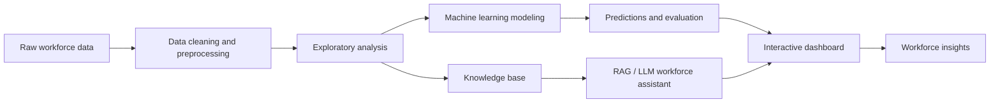

# Workforce Insights Dashboard for Employee Skills and Analytics

<p align="center">
  <strong>AI-powered workforce analytics for skills, talent intelligence, and data-informed workforce planning.</strong>
</p>

<p align="center">
  
  
  
  
  
</p>

## Overview

This project creates an end-to-end workforce intelligence solution that combines:

- employee and skill data analysis
- attrition-risk prediction using machine learning
- interactive dashboard visualization
- AI-powered retrieval using a TF-IDF + FAISS RAG workflow

It is designed to help HR teams, managers, and leadership understand workforce composition, competency risks, and employee trends through a single analytics experience.

## Dashboard Preview

> Open the dashboard here: [AI-Powered Workforce Analytics Dashboard (2).html](./AI-Powered%20Workforce%20Analytics%20Dashboard%20%282%29.html)

<p align="center">
  
</p>

> Replace the placeholder image above with an actual dashboard screenshot after running the project locally.

## Project Objectives

- Analyze workforce composition by role, department, and skills
- Identify attrition-related risk factors and retention patterns
- Explore employee performance, satisfaction, and engagement trends
- Support decision-making with interactive visual analytics
- Provide natural-language workforce queries through a retrieval-based assistant

## Key Features

| Feature | Description |
| --- | --- |
| Data preparation | Clean and transform employee data for analysis |
| Workforce analytics | Explore patterns by department, role, age, tenure, and performance |
| Predictive modeling | Compare multiple machine learning models for attrition prediction |
| AI workforce assistant | Use retrieval with TF-IDF + FAISS to answer workforce questions |
| Interactive dashboard | Present insights in an HTML dashboard |
| Documentation set | Includes notebooks, project docs, presentations, and workbooks |

## Repository Contents

| File | Purpose |
| --- | --- |
| [`02_data_cleaning_preprocessing.ipynb`](./02_data_cleaning_preprocessing.ipynb) | Data cleaning and preprocessing |
| [`04_ml_modeling.ipynb`](./04_ml_modeling.ipynb) | Model development and evaluation |
| [`05_ml_predictions.ipynb`](./05_ml_predictions.ipynb) | Prediction workflow |
| [`06_rag_llm_workforce_assistant.ipynb`](./06_rag_llm_workforce_assistant.ipynb) | RAG-based workforce assistant |
| [`AI-Powered Workforce Analytics Dashboard (2).html`](./AI-Powered%20Workforce%20Analytics%20Dashboard%20%282%29.html) | Interactive dashboard |
| [`database.py`](./database.py) | PostgreSQL connection helper |
| [`dataset for internship_raw.xlsx`](./dataset%20for%20internship_raw.xlsx) | Raw workforce dataset |
| [`xgboost_attrition_pipeline.pkl`](./xgboost_attrition_pipeline.pkl) | Serialized model artifact |
| `*.pptx` and `*.docx` | Project presentations and supporting documentation |
| `*.xlsx` | Supporting datasets and test files |

## Technology Stack

- Python
- Jupyter Notebook
- Pandas / NumPy
- Scikit-learn
- XGBoost
- FAISS
- SQLAlchemy / psycopg2
- HTML / JavaScript dashboard
- PostgreSQL (for the ML workflow)

## Model Performance Summary

The machine learning workflow compares several models on the workforce attrition dataset. Based on the notebook output, the results are:

| Model | Accuracy | Precision | Recall | F1 Score | ROC AUC |
| --- | ---: | ---: | ---: | ---: | ---: |
| Logistic Regression | 0.7517 | 0.3523 | 0.6596 | 0.4593 | 0.8145 |
| Decision Tree | 0.8027 | 0.4035 | 0.4894 | 0.4423 | 0.6195 |
| Random Forest | 0.8503 | 0.6364 | 0.1489 | 0.2414 | 0.8161 |
| Gradient Boosting | 0.8673 | 0.7857 | 0.2340 | 0.3607 | 0.8310 |
| XGBoost | 0.8605 | 0.6875 | 0.2340 | 0.3492 | 0.8400 |

### Interpretation

- Gradient Boosting and XGBoost achieve the highest overall accuracy.
- Logistic Regression performs best in terms of recall, which is often more important in attrition-risk detection because it identifies more at-risk employees.
- The class imbalance in the dataset means one should review precision/recall trade-offs before selecting a final model for production use.
- For a real deployment, it is advisable to add cross-validation, class-weight tuning, confusion matrices, and business validation before making a final decision.

## Project Workflow



## Getting Started

### 1) Clone the repository

```bash
git clone https://github.com/sanjay-22-bhargav/Creation-of-Workforce-Insights-Dashboard-for-Employee-Skill-and-Analytics.git
cd Creation-of-Workforce-Insights-Dashboard-for-Employee-Skill-and-Analytics
```

### 2) Create and activate a virtual environment

```bash
python -m venv .venv

# macOS / Linux
source .venv/bin/activate

# Windows PowerShell
.venv\Scripts\Activate.ps1
```

### 3) Install dependencies

```bash
python -m pip install --upgrade pip
python -m pip install jupyter pandas numpy scikit-learn xgboost faiss-cpu sqlalchemy psycopg2-binary python-dotenv
```

### 4) Start the dashboard locally

```bash
python -m http.server 8000
```

Then open:

```text
http://localhost:8000
```

Select `AI-Powered Workforce Analytics Dashboard (2).html` from the list.

### 5) Run the notebooks

```bash
jupyter notebook
```

Run the notebooks in this order:

1. `02_data_cleaning_preprocessing.ipynb`
2. `04_ml_modeling.ipynb`
3. `05_ml_predictions.ipynb`
4. `06_rag_llm_workforce_assistant.ipynb`

### 6) Database setup for the ML workflow

The modeling notebook expects a PostgreSQL instance with a database named `workforce_intelligence` and a table named `workforce_analytics`.

If you are running the ML notebook locally:

```sql
CREATE DATABASE workforce_intelligence;
```

Then import the prepared employee dataset into a `workforce_analytics` table or connect your local database to the notebook environment.

> The notebook uses a local PostgreSQL connection with default values for host, port, user, and database. You may need to update these values if your local setup differs.

## Responsible Use

Workforce analytics can influence important employment decisions. Before using this project with real employee data:

- Remove personally identifiable or confidential information
- Validate model accuracy, fairness, and bias across relevant groups
- Do not use predictions as the sole basis for employment decisions
- Keep a human reviewer involved in decision-making
- Protect datasets, logs, and credentials appropriately

## Future Improvements

- Add a pinned `requirements.txt` file
- Add a proper `environment.yml` for easier reproduction
- Add automated tests for preprocessing and model validation
- Include screenshots and architecture diagrams in a docs folder
- Add data dictionaries and feature documentation
- Clean up notebook paths so the project is portable across machines
- Add a `.gitignore` for logs, secrets, checkpoints, and virtual environments

## License

This project is licensed under the terms of the [LICENSE](./LICENSE) file.

## Author

**Sanjay Bhargav**

[GitHub Profile](https://github.com/sanjay-22-bhargav)
