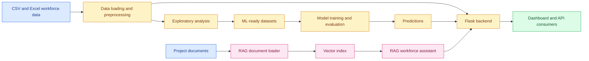

# Workforce Insights Dashboard

<p align="center">
  
  
  
  
</p>

<p align="center">
  <strong>A data, machine-learning, and AI-assisted platform for understanding employee skills, workforce composition, and talent trends.</strong>
</p>

<p align="center">
  <a href="#-quick-start">Quick start</a> ·
  <a href="#-project-architecture">Architecture</a> ·
  <a href="#-repository-guide">Repository guide</a> ·
  <a href="#-responsible-use">Responsible use</a>
</p>

---

## 📌 Overview

The **Workforce Insights Dashboard for Employee Skill and Analytics** combines prepared workforce data, exploratory analysis, machine-learning experiments, a Flask API, and a retrieval-augmented generation (RAG) assistant to provide a structured picture of the workforce.

The project is intended to help analysts and workforce-planning teams:

- understand workforce composition across roles, departments, and skills;
- identify skill patterns and potential development opportunities;
- explore workforce and employee-level analytics through APIs and dashboards;
- experiment with prediction workflows such as attrition and promotion analysis; and
- ask natural-language questions over project knowledge and workforce context.

> **Note:** This repository contains research, coursework, and decision-support material. It is not a ready-to-deploy HR decision system.

## ✨ Highlights

| Capability | Description |
| --- | --- |
| **Interactive dashboard** | A standalone HTML dashboard and a Power BI `.pbix` artifact for exploring workforce insights. |
| **Data preparation** | CSV and Excel workforce files are processed into analysis-ready datasets. |
| **Machine learning** | Jupyter workflows for feature preparation, model training, evaluation, and predictions. |
| **Flask backend** | API routes for dashboard data, employee records, analytics, predictions, and chat. |
| **RAG assistant** | Document loading, indexing, vector retrieval, and LLM response generation for workforce questions. |
| **Project evidence** | Milestone reports, presentation material, test workbooks, and supporting documentation. |

## 🖥️ Dashboard preview

The repository includes a self-contained HTML dashboard:

**[Open the AI-Powered Workforce Analytics Dashboard](./AI-Powered%20Workforce%20Analytics%20Dashboard%20%282%29.html)**

For best results, serve the repository with a local HTTP server rather than opening the HTML file directly. This avoids browser restrictions around local assets and relative paths.

## 🏗️ Project architecture



## 🗂️ Repository guide

```text
.
├── AI-Powered Workforce Analytics Dashboard (2).html  # Standalone HTML dashboard
├── WorkForce_Dashboard.pbix                            # Power BI dashboard artifact
├── DATA/                                               # Raw and processed workforce CSV files
├── Backend/                                            # Flask API and service layer
│   ├── app.py                                          # Application entry point
│   ├── data_loader.py                                  # CSV/Excel loading and normalization
│   ├── *_routes.py                                     # Dashboard, employee, analytics, prediction, chat routes
│   ├── *_service.py                                    # Backend business logic
│   ├── attrition_model.py                              # Attrition model integration
│   ├── promotion_model.py                              # Promotion model integration
│   └── requirements.txt                                # Backend dependencies
├── ML/                                                 # Modeling notebooks and prepared datasets
│   ├── 04_ml_modeling.ipynb                            # Model development and evaluation
│   ├── 05_ml_predictions.ipynb                         # Prediction workflow
│   ├── ML_Ready_Dataset.csv                            # Prepared modeling data
│   ├── Feature_Classification.xlsx                     # Feature reference workbook
│   └── X_train.csv, X_test.csv, y_train.csv, y_test.csv
├── RAG/                                                # Retrieval-augmented generation workflow
│   ├── build_index.py                                  # Build the vector index
│   ├── rag_service.py                                  # Retrieval service
│   ├── generator.py                                    # Response generation
│   ├── document_loader.py                              # Knowledge-source loading
│   └── 06_rag_llm_workforce_assistant.ipynb            # RAG/LLM notebook
├── project/                                            # Reports and milestone deliverables
├── Agile.xlsx                                          # Agile/project tracking workbook
├── Unit Test.xlsx                                      # Test evidence/workbook
├── LICENSE                                             # Project license
└── README.md                                           # This guide
```

More detailed module documentation is available in:

- [Backend README](./Backend/README.md)
- [Machine Learning README](./ML/README.md)
- [RAG README](./RAG/README.md)

## 🚀 Quick start

### 1. Clone the repository

```bash
git clone https://github.com/sanjay-22-bhargav/Creation-of-Workforce-Insights-Dashboard-for-Employee-Skill-and-Analytics.git
cd Creation-of-Workforce-Insights-Dashboard-for-Employee-Skill-and-Analytics
```

### 2. View the HTML dashboard

```bash
python -m http.server 8000
```

Open [http://localhost:8000](http://localhost:8000) and select **AI-Powered Workforce Analytics Dashboard (2).html**.

### 3. Set up the backend

```bash
python -m venv .venv

# macOS/Linux
source .venv/bin/activate

# Windows PowerShell
.\.venv\Scripts\Activate.ps1

python -m pip install --upgrade pip
python -m pip install -r Backend/requirements.txt
cd Backend
python app.py
```

The Flask service runs at `http://localhost:5000` by default. The backend documentation describes the health checks and route groups:

- `GET /`
- `GET /api/health`
- `/api/dashboard`
- `/api/employees`
- `/api/analytics`
- `/api/predict`
- `/api/chat`

### 4. Run the machine-learning notebooks

The ML workflow is documented in [ML/README.md](./ML/README.md). A typical environment can be created with:

```bash
python -m pip install jupyter pandas numpy scikit-learn xgboost matplotlib seaborn openpyxl joblib
jupyter lab
```

Recommended workflow:

1. Confirm the source and processed datasets are current.
2. Review the feature definitions in `ML/Feature_Classification.xlsx`.
3. Run `ML/04_ml_modeling.ipynb` from top to bottom.
4. Review the target definition, split strategy, metrics, and model outputs.
5. Run `ML/05_ml_predictions.ipynb` using the same feature schema as training.
6. Validate outputs before using them in the backend or dashboard.

### 5. Run the RAG workflow

See [RAG/README.md](./RAG/README.md) for configuration and provider-specific setup. RAG or LLM features may require environment variables and external API credentials.

**Never commit API keys, access tokens, private documents, `.env` files, or generated secrets.**

## 📊 Data and modeling notes

The main data assets include:

- `DATA/workfroce data.csv` — source workforce data currently stored in the repository;
- `DATA/workforce processed data.csv` — processed workforce data;
- `ML/ML_Ready_Dataset.csv` — dataset prepared for machine-learning experiments; and
- `ML/X_train.csv`, `ML/X_test.csv`, `ML/y_train.csv`, `ML/y_test.csv` — training and hold-out files.

Before rerunning or extending the workflow:

- verify the input path and expected columns;
- document missing-value handling and categorical encoding;
- keep preprocessing identical between training and inference;
- check for duplicate records and target leakage;
- record the dataset version, random seed, package versions, and evaluation metrics; and
- treat serialized model artifacts as coupled to their training data and preprocessing code.

## 🧪 Testing and reproducibility

This project includes a `Unit Test.xlsx` workbook and milestone documentation. For repeatable notebook results:

- create a clean virtual environment;
- restart the notebook kernel before running all cells;
- run cells in order rather than relying on prior interactive state;
- set random seeds where supported;
- validate schemas before model inference; and
- record changes to data, dependencies, and model artifacts.

Future engineering improvements could include automated data-quality checks, Python unit tests, notebook smoke tests, pinned environment files, and CI validation.

## 🔐 Responsible use and privacy

Employee and workforce data can be sensitive. Use this repository responsibly:

- use anonymized, synthetic, or explicitly approved data whenever possible;
- remove unnecessary names, contact details, employee identifiers, and confidential fields;
- restrict access to raw data, logs, model files, and generated predictions;
- do not use model predictions as the sole basis for hiring, promotion, compensation, disciplinary, or termination decisions;
- evaluate accuracy, calibration, stability, and fairness across relevant groups;
- communicate uncertainty and known limitations to dashboard users; and
- keep a qualified human reviewer accountable for consequential decisions.

Historical labels and exploratory correlations should not automatically be presented as reliable predictions of future employee behavior.

## 🛣️ Roadmap

- Add a repository-wide `requirements.txt` or `environment.yml` with pinned versions.
- Add a data dictionary and model card for each production-quality model.
- Add automated tests for preprocessing, routes, and prediction input validation.
- Add dashboard screenshots and documented example API responses.
- Move reusable notebook logic into tested Python modules.
- Add schema validation and dataset versioning.
- Add deployment documentation for the Flask API and dashboard.
- Add a safe configuration template for RAG providers without exposing credentials.

## 📚 Project documentation

Supporting deliverables are available in the [`project/`](./project/) directory, including milestone reports and the final report. The presentation is available at:

[Creation of Workforce Insights Dashboard for Employee Skill and Analytics.pptx](./Creation%20of%20Workforce%20Insights%20Dashboard%20for%20Employee%20Skill%20and%20Analytics.pptx)

## 📄 License

See the [LICENSE](./LICENSE) file for the applicable license terms.

## 👤 Author

**Sanjay Bhargav**  
[GitHub profile](https://github.com/sanjay-22-bhargav)
