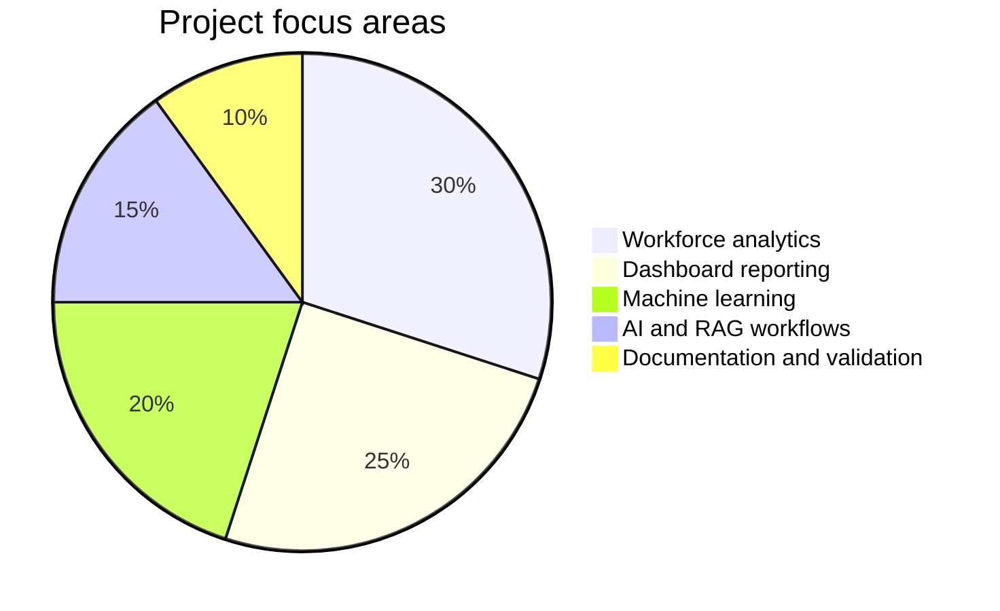
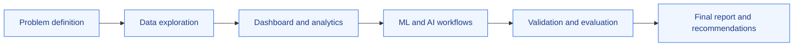

# Project Documentation

  
  
  

  <strong>Formal documentation, milestone evidence, and final deliverables for the Workforce Insights Dashboard.</strong>

  <a href="#-project-overview">Overview</a> ·
  <a href="#-deliverables">Deliverables</a> ·
  <a href="#-project-journey">Project journey</a> ·
  <a href="#-related-resources">Resources</a>

---

## 📌 Project overview

This folder contains the core documentation and supporting deliverables for the **Workforce Insights Dashboard for Employee Skill and Analytics**.

The project combines workforce data analysis, skill and employee-level insights, machine-learning experiments, AI-assisted retrieval workflows, dashboard reporting, and API-based analytics. The documents in this directory preserve the project lifecycle from initial requirements through milestone reviews and final recommendations.

> **Scope note:** The materials are intended for academic, research, and decision-support purposes. They should not be treated as a production HR decision system or as a replacement for qualified human judgment.

## 🎯 Project objectives

- Analyze workforce composition across employees, roles, departments, and skills.
- Identify workforce patterns that can support planning and development activities.
- Explore machine-learning workflows for attrition and promotion-related questions.
- Provide dashboard and API-based access to workforce insights.
- Document the project’s requirements, progress, validation, and conclusions.

## 📈 Project at a glance

## 📚 Deliverables

| Document | Purpose |
| --- | --- |
| [`Project Description (1).docx`](./Project%20Description%20%281%29.docx) | Project goals, scope, context, requirements, and expected outcomes. |
| [`milestone 1.pdf`](./milestone%201.pdf) | Initial milestone and early project progress. |
| [`Milestone_2 .pdf`](./Milestone_2%20.pdf) | Expanded analysis, implementation updates, and project progress. |
| [`Milestone 3.pdf`](./Milestone%203.pdf) | Third milestone review and progress summary. |
| [`Milestone 4 .pdf`](./Milestone%204%20.pdf) | Advanced implementation, evaluation, and milestone evidence. |
| [`Final Report.pdf`](./Creation%20of%20Workforce%20Insights%20Dashboard%20for%20Employee%20Skill%20and%20Analytics%20-%20Final%20Report.pdf) | Final project report containing the complete analysis, outcomes, and recommendations. |
| [`doc`](./doc) | Supporting or placeholder documentation file. |

## 🧭 Recommended reading order

For the clearest understanding of the project, review the documents in this order:

1. **Project Description** — understand the business context, scope, and requirements.
2. **Milestone 1** — review the initial project direction and early progress.
3. **Milestones 2–4** — follow the evolution of the analysis, implementation, and evaluation.
4. **Final Report** — review the complete project outcome, conclusions, and recommendations.
5. **Implementation resources** — use the repository root and module documentation to inspect the working dashboard, data, backend, ML, and RAG components.

## 🗺️ Project journey

| Phase | Focus | Evidence |
| --- | --- | --- |
| **1. Define** | Problem framing, context, scope, and requirements | Project Description |
| **2. Explore** | Workforce data, skills, roles, and organizational patterns | Milestone 1 |
| **3. Build** | Dashboard, analytics services, ML experiments, and AI workflows | Milestones 2–3 |
| **4. Evaluate** | Testing, review, refinement, and project validation | Milestone 4 |
| **5. Deliver** | Final analysis, conclusions, and recommendations | Final Report |

## 🔗 Relationship to the repository

The documentation in this folder supports the implementation areas below:

- [`DATA/`](../DATA/) — workforce datasets used for analysis.
- [`ML/`](../ML/) — machine-learning notebooks, prepared datasets, and modeling workflows.
- [`Backend/`](../Backend/) — Flask API for dashboard data, analytics, predictions, and chat.
- [`RAG/`](../RAG/) — retrieval-augmented generation and AI assistant logic.
- [Interactive HTML dashboard](../AI-Powered%20Workforce%20Analytics%20Dashboard%20%282%29.html) — browser-based dashboard front end.
- [`WorkForce_Dashboard.pbix`](../WorkForce_Dashboard.pbix) — Power BI dashboard artifact.

## ✅ What this documentation demonstrates

These deliverables provide evidence of:

- clear problem definition and project planning;
- data-driven workforce analysis;
- technical and architectural design decisions;
- dashboard, API, ML, and AI-assisted implementation work;
- milestone-based progress and validation; and
- final conclusions and recommendations.

## ⚠️ Responsible use

Workforce and employee information may be sensitive. When using the project materials:

- use anonymized, synthetic, or approved data whenever possible;
- protect employee identifiers and confidential fields;
- do not use model outputs as the sole basis for employment decisions;
- review accuracy, limitations, fairness, and uncertainty; and
- keep a qualified human decision-maker accountable for consequential decisions.

Historical workforce labels and exploratory correlations should not automatically be presented as reliable predictions of future employee behavior.

## 📝 Documentation notes

- File names retain the spacing and capitalization used in the repository, including `Milestone_2 .pdf` and `Milestone 4 .pdf`.
- This directory is documentation-focused and does not contain the primary application code.
- For setup instructions and technical details, refer to the repository root README and the module-specific READMEs.

## 📎 Related resources

- [Repository README](../README.md)
- [Backend README](../Backend/README.md)
- [Machine Learning README](../ML/README.md)
- [RAG README](../RAG/README.md)

---

**Workforce Insights Dashboard for Employee Skill and Analytics**  
Formal project documentation and deliverable archive.